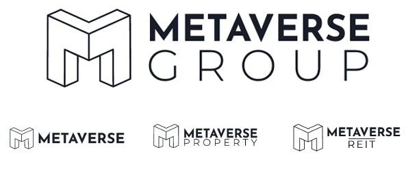
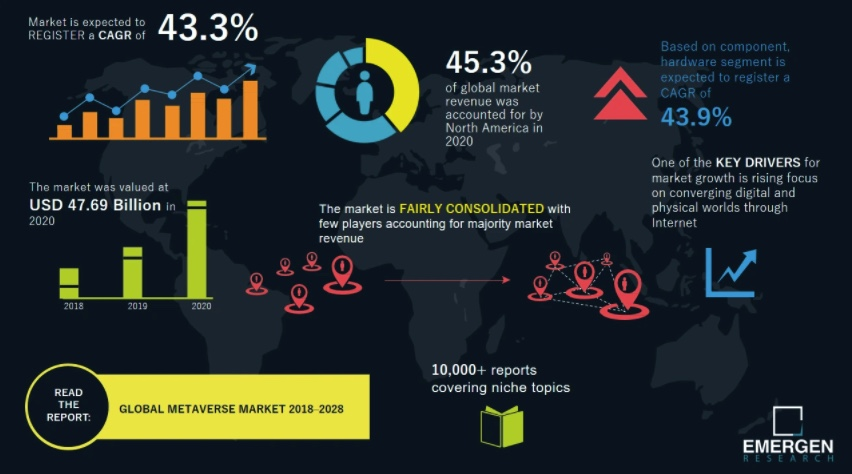
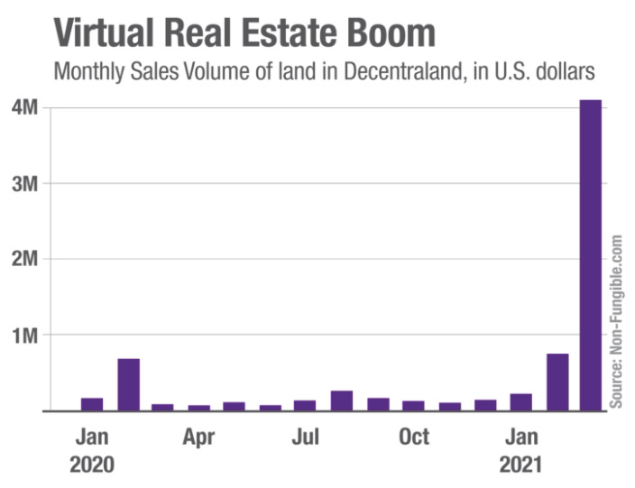
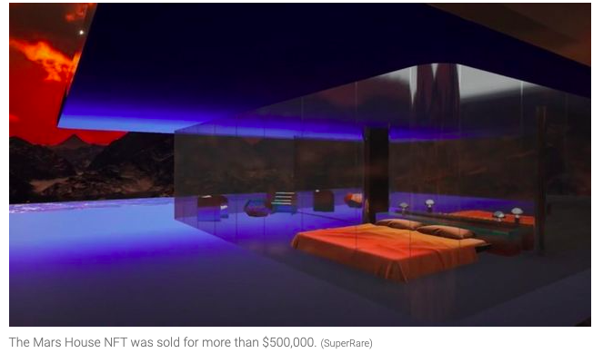
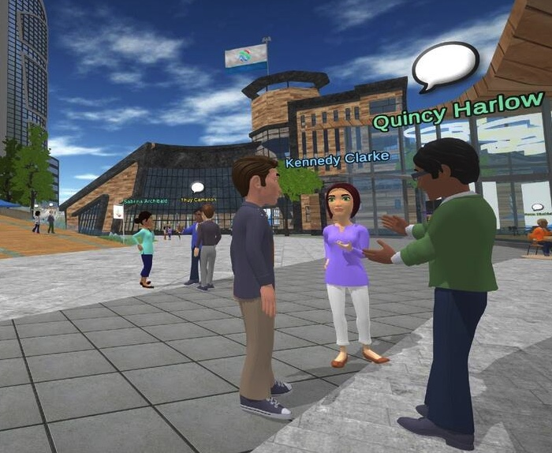
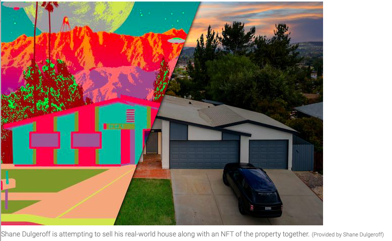

# Real Estate for the Virtual World!

*Have you ever imagined of buying a piece of land which is accessible only digitally and has no physical existence?*

*Welcome to world of **Virtual Real Estate*** at **Metaverse Group!**

# Introduction to Metaverse Group
*A vertically integrated real estate company for the metaverse economy*

### **a) Brief Snapshot:** 

* **Metaverse Group** is one of Canada’s first virtual real estate companies and was founded in 2020 as a joint venture between **GDA Capital Corporation** and **Wolfest Woods**, with a board that consists of **Michael Gord and Jason Cassidy**; the pair claim to be amongst the earliest adopters of blockchain technology in Canada.

* **Metaverse Group**, which has its global headquarters in the virtual world **“Crypto Valley”** from **“Decentraland,”** consists of several firms focused in different areas of the metaverse industry including *real estate acquisition, development, real estate investment trust management, metaverse district development, metaverse capital markets, and other related services.* **Metaverse Group** also offers additional services including *virtual property development, property management, and assisting companies with marketing and advertising in the metaverse.*
  
### **b) Business Idea:** 

* **Metaverse Group** was formed by Canadian cryptocurrency entrepreneurs **Michael Gord**, the founder & CEO of GDA Group, and **Jason Cassidy**, the CEO of Game Credits – two of the earliest adopters of metaverse technology in the world. The two shared similar passions on **NFTs, metaverse and real estate** which led them to discover a disruptive opportunity with metaverse, essentially the immersive internet, and began building the foundation for the first vertically integrated digital real estate firm for the modern economy.

> "I’ve been into blockchains and digital assets for my entire professional career.. Jason Cassidy and I have been friends and colleagues on various projects for a while. He was investing quite heavily into NFTs and the metaverse. His description of Decentraland, Sandbox, and Somnium and his perspective on the future of the metaverse and virtual worlds was compelling and convinced me that it was worth getting some exposure in.”- Michael Gord, COO Metaverse Property

### **c) Funding and Acquistion:** 

* **Tokens.com** Corp purchased a 50% stake in **Metaverse Group** valued **$1.68 million CAD** on October 18, 2021.
Tokens.com issued two million common shares at an issue price of CAD$0.84, making it one of the highest value equity investments ever in a specialized Metaverse real estate company. **Tokens.com** received twenty-five million shares of Metaverse Group for its 50% ownership position.

# Understanding the concept of Metaverse & Virtual Real Estate

### **a) What is Metaverse?:** 

#### 
  *“The Metaverse is going to be one of the biggest revolutions in computing - right up there with the mobile revolution and the internet revolution,” says Tokens.com CEO, Andrew Kiguel.*

 

* The metaverse refers to a collectively shared virtual space that arises through the convergence of virtual and augmented reality, as well as the internet. It’s often heralded as a burgeoning, next-generation iteration of the internet, consisting of universally existent / accessible, three-dimensional, shared virtual spaces residing within a larger virtual universe. It is thus an online world where people can work, play games, and communicate in a virtual environment as avatars.

* The metaverses have become a  hot commodity with more people joining them each day to take advantage of all of the features they offer, be it shopping, social, gaming, entertainment, education or building your own business.

* These virtual worlds are built on encrypted blockchains, typically with their own cryptocurrencies. In addition to being able to craft new, alternative identities, make friends, display digital artwork, or have virtual affairs, you can conduct safe and—if you choose—large-scale financial transactions.

### **b) Growth of the Global Metaverse Market:** 

* The global metaverse market is expected to expand at a **CAGR of 43.3% from USD 47.69 Billion in 2020 to USD 828.95 Billion in 2028.** Increasing demand for Mixed Reality (MR) to connect with metaverse without virtual reality headsets is propelling revenue growth of the market.

 
### **c) What is Virtual Real Estate in Metaverse:** 

* A piece of land on a blockchain-based real estate economy accessible only digitally and having no physical existence is called a virtual real estate.

* The land, which can be identified by a system of cartesian coordinates, will allow the owners to develop a wide range of projects from a static property to an interactive games arena. 

* This piece of virtual real estate is in the form of a ***Non-fungible token or NFTs***, a piece of data stored on a blockchain. The popularity and evolution of virtual real estate are directly linked to mainstream NFT awareness and popularity. **Twitter founder Jack Dorsey’s first tweet was sold as an NFT for $2.9 million.** NFT which was earlier used to buy artwork and music is now being used to buy virtual real estate.

### **d) Monetization and Valuation of Virtual Real Estate:** 

* *Monetization* : In many ways, monetization of one’s assets in the metaverse mirrors that of reality. For instance, users can collect rent on their commercial/residential properties from other tenants, hold land/property parcels and wait for price/capital appreciation (i.e., “flipping”), offer and transact for a variety of products/services on-platform, among others.

* *Valuation* : In regards to valuation, virtual real estate in the metaverse draws additional similarities to tangible real estate in reality. For instance, there is considerable overlap in terms of many of the key valuation factors, which include some of the following: 
  -	Land/parcel sizes and dimensions
  -	Land/parcel location 
  -	Proximity to key on-platform features (e.g., in-demand natural landscapes, vibrant commercial areas, etc.) 
  -	Visual aesthetic/appeal 
  -	Scarcity across different land/parcel types 
  -	Strategic utility for users (e.g., completing property collections, treasure-hunts, etc.) 
  -	Corporate adoption in various regions 
  -	Broader intra/inter-platform macroeconomic factors

# Business Activities of Metaverse Group

**Metaverse Group** provides a broad spectrum of fully integrated metaverse real estate services and solutions. 

#### 
 *“Being the first company to focus on and cater to the burgeoning virtual real estate market for the Metaverses means a lot to us – As more and more people are exposed to the concept of the Metaverses it is a natural progression for some to want to own a piece of that digital world and this is where Metaverse Property truly shines. When you are ready to make your initial foray into the fascinating realm of the Metaverses, we will be there to help you along the journey”.* - Jason Cassidy, CTO, Metaverse Property 

### **a) Overview of Services Offered:** 

The Metaverse Group offers :

* Buying and selling of virtual real estate
* Full property management of existing businesses
* Finding a rental within the metaverses to fit any need
* Development to deployment of  virtual land
* Investment exposure via the Metaverse Property REIT
* Expert level consulting for all major metaverses
* Marketing and advertising your business in the metaverse
* A capital markets arm, Metaverse Capital which acts as the principal behind transactions
* Thought leadership in metaverse transformations for enterprises
* Architectural visualisation of the virtual real estate

### **b) Presence across different Virtual Blockchain Worlds(VBW’s) :** 

The **Metaverse Group** provides services across multiple platforms including *Decentraland, The Sandbox, Somnium Space, Cryptovoxels, and Upland.* *Click [HERE](https://www.polygonalmind.com/blog-posts/metaverse-platform-comparison-virtual-worlds-on-the-blockchain) for more information on the details of each metaverse platform.*

### **c) Target customers:** 

As crypto adoption continues to increase worldwide, there are more investors who are looking out for new digital asset classes. Metaverse real estate provides potentially a game-changing opportunity for brands, advertisers and vendors wishing to reach demographics in every corner of the globe. **Metaverse Group** offers a one stop solution to these customers looking to capitalize on the Metaverse Real Estate trend.

Metaverse enthusiasts compare the rush to buy virtual land to the scramble for domain names in the early days of the internet. There are currently a few thousand unique landowners on each of the main blockchain-based platforms. Their theory is that as more people congregate in these environments, plots of land in central locations will be highly sought-after because of the amount of visitor traffic

### **d) Technology used :** 

**Metaverse Group** is a leader in its industry as it integrated the whole bouquet of technological services such as Blockchain, NFTs, Cryptocurrency, Smart Contracts, Virtual Reality (VR), Augmented Reality (AR) and Mixed Reality (MR) in its offerings.

# Landscape of Recent Industry Trends

**Metaverse Group** is catering to the real estate market in the Metaverse world. 
We have seen a lot of changes in both the real estate industry as well as the metaverse world. Let us explore some of the current developments, future trends and competitive scenario which will have a direct impact on the business of Metaverse Group.

### **a) Metaverse Trends** 

 *   *Growth of accessibility to the virtual world* : 
The developments in VR gadgets have made virtual reality more accessible and enjoyable. Apple is working on a VR & AR-based mixed reality headset which it plans to release by 2025. These kinds of innovations can make the virtual world more accessible and make it the next hotspot for entertainment and interaction. 

*   *Increase in number of events in the Metaverse world* : 
As more people congregate in these virtual cities, we have seen a lot more engaging activity. Artists like Snoop Dogg and Ariana Grande have performed in the Metaverse.

*   *Entry of large corporations in the Metaverse* : 
The Metaverse trend is garnering extra attention lately, as Mark Zuckerberg announced that he thinks the Metaverse is the inevitable future of the Internet and even officially renamed Facebook as “Meta.” 

### **b) Trends in the Virtual Real Estate** 

 *   *Growth of new spaces* : 
Decentraland is also developing a Washington D.C.-sized virtual city called Genesis. Video game developer Atari is collaborating with Decentraland to develop a world-class virtual casino in Genesis. Some online worlds, like Upland and SuperWorld, have created virtual platforms based on locations in the real world. In these places, buyers can purchase fictional versions of actual existing real estate, like the Empire State Building.

*   *Increasing number of transactions and value* : 
Decentraland has seen more than $50 million in total sales, including land, avatars, usernames and wearables like virtual outfits. The ownership rights to the Mars House, a sleek but fictional glass home on the red planet designed by artist Krista Kim, went for more than $500,000 in March. For comparison, the median list price of a home in the real world was $380,000 in May, according to Realtor.com® data.

*   *Customer preferences* : 
Fans of today’s cyberspaces are spending much more modest amounts on virtual land where they can create the homes of their dreams outfitted with all of the amenities they can’t afford in the real world. Users can even get mortgages, in some instances, or pay a builder to put up a “home” on their virtual properties.

### **c) Growth of companies in Virtual Real Estate** 

Virtual real estate is sold as NFT’s on the ethereum blockchain. They can be purchased directly from the platform as well as from a secondary market such as Opensea. 
This is a nascent segment and we have many companies finding their competitive advantage in the differentiated value they have to offer. Noteable competitors to Metaverse Group are Republic Realm , RealT, RealBlocks, eXp Realty and The Bee Token. 

# Results of Metaverse Group

**Metaverse Group** in a short period of time has been able to create a competitive advantage and diversify in the metaverse real estate space. Though the financials are yet to be posted they have they have successfuuly worked with different enterprises, capital groups, funds, blockchain companies and other stakeholders to create an ecosystem of real estate services in the metaverse. 

Also they have successfully launched the “metaverse real estate investment trust (REIT)”, which will trade through a non-fungible token (NFT) that is backed by the company’s virtual land portfolio. Tokens.com and Metaverse have worked together to develop the Metaverse REIT, where REIT is meant to be represented by an NFT token with each token representing a relative ownership of the total portfolio of assets under management. The more NFT tokens that are owned, the larger percentage of the REIT an investor owns. 

# Summary and Recommendation

Depending on whom you ask, the virtual real estate business could become the next big thing—or wind up the next big bust. It’s a bit like the early days of Bitcoin. Some investors are worried about missing the opportunity to buy digital property in the most popular metaverses—like Decentraland, The Sandbox, Cryptovoxels, and Somnium Space—while they still can.

While metaverses are by no means mainstream, investors are betting that it will change as they attract a critical mass of a younger audience. Once they develop a strong user base, the theory goes, they’ll become more attractive to advertisers who have the money to open virtual stores or entrepreneurs who can create just about anything they can conceive of.

Basis these trends I have summarised my recommendations for **Metaverse Group** as below:

### **a) Diversification of Business Model**

We are just scratching the surface of the potential of Metaverse. There are going to be thousands of new business models that get created through the metaverse. I recommend that **Metaverse Group** diversify into creating and selling avatars and games thereby targeting Gen Z. Gen Z isn’t gobbling up large amounts of online real estate—yet. Most members don’t have the tens of thousands of dollars required to do so. But experts predict they will turn to these metaverses both as places to hang out, and eventually as places to invest. That’s why the real estate could become valuable for companies that are marketing to them.

###  **b) Leverage synergy with Tokens.com**

**Metaverse Group** and Tokens.com can capitalize on their synery in which **Metaverse Group** builds and accumulates different real estate formats such as complexes, shopping centers, casinos and other residentials and office workspaces. With these assets in place Tokens.com  can rent it to its cryptocurrency user base  of individuals and organizations. 

###  **c) Building landmark Assets in the Real and Virtual world**

Building and selling landmark assets for inidividuals and enterprises that are similar to the real world will provide a differntiation to **Metaverse Group** compared to other firms within the same industry. **Metaverse Group** has got a competitive advantage with a strong head start in the virtual real estate space and needs to ensure it is ahead of the curve in all its latest offering. There is a strong consumer trend of wanting to own similar assets in both world's and **Metaverse Group** should stay ahead of this curve.

###  **d) Integrate mortgage services for the Metaverse**

We all know the improtance of mortgage service in real estate. However due to the limitation of mortgage sevices for people who want to invest in the metaverse, there is an untapped market waiting to be explored. By integrating mortgage services **Metaverse Group** will be able to create a platform of exponential growth in providing real estate solutions in the metaverse.

___

**Resources**

* [Metaverse Group](https://en.wikipedia.org/wiki/Chime_(company))
* [Metaverse Property](https://metaverse.properties/)
* [Metaverse REIT](https://metaversereit.com/)
* [Reuters](https://www.reuters.com/business/metaverse-bet-crypto-rich-investors-snap-up-virtual-real-estate-2021-04-19/)
* [Emergen Research](https://www.emergenresearch.com/industry-report/metaverse-market)
* [Crunchbase](https://www.crunchbase.com/organization/metaverse-group)
* [Interview with Michael Gord](https://edgeofnft.com/michael-gord-of-metaverse-group-on-the-digital-real-estate-boom-plus-teens-cashing-in-on-nfts-louis-vuitton-nft-game-fortune-mag-nft-sale-update-and-more/)
* [Businesswire](https://www.businesswire.com/news/home/20211018005069/en/Tokens.com-Announces-the-Closing-of-its-Acquisition-of-50-of-Metaverse-Group-One-of-the-Worlds-First-Virtual-Real-Estate-Companies)
* [Bloomberg](https://www.bloomberg.com/news/articles/2021-03-19/virtual-land-prices-are-booming-and-now-there-s-a-fund-for-that)
* [Investopedia](https://www.investopedia.com/metaverse-definition-5206578)
* [Analytics India Mag](https://analyticsindiamag.com/virtual-real-estate-stuff-science-fictions-are-made-of/)
* [Data Driven Investor](https://medium.datadriveninvestor.com/virtual-real-estate-fad-or-future-9c176010356a)
* [GDA Capital](https://gda.capital/metaverse-group/)
* [Realtor.com](https://www.realtor.com/news/trends/metaverse-digital-real-estate-land-rush/)
* [Tech Republic](https://www.techrepublic.com/article/one-companys-virtual-reality-approach-could-end-the-debate-over-working-from-home/)